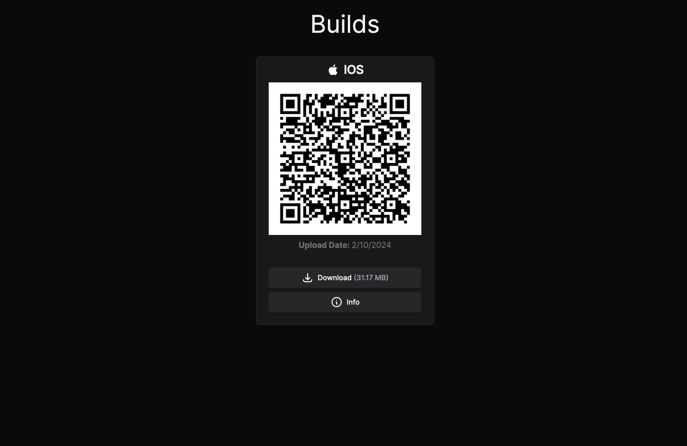

# Papyonlab's Artifacts Platform


## Introduction


This platform is a web-based application designed to facilitate the uploading and sharing of build artifacts among team members. It supports ad-hoc builds and APK files, along with direct installation of IPA files for iOS applications via iTunes.

## Installation

To set up the platform, start by installing the dependencies:

```
yarn install
```

Copy the `.env.example` file to `.env` and update the environment variables as needed.

```bash
cp .env.example .env
```

Start the server

```
yarn build && yarn start
```

### Via Docker (Build)

```bash
docker run -d -p 3005:3000 -e HOST="http://localhost:3005"  -v ./uploads:/app/uploads papyonlab/appload
```


## Usage

Once the server is up, access the platform via a web browser at http://localhost:3000. Artifacts can be uploaded using any tool that supports the multipart/form-data format. For example, to upload artifacts via the curl command:

```bash
curl --location --request PUT 'http://localhost:3000/api/upload' \
--form 'artifact=@"/path/to/your/artifact.ipa"' \
--form 'appName="your-app-name"' --progress-bar  | cat

############################################ 100.0%
> http://localhost:3000/build/your-app-name/
```


